# 🚀 GCP Slack Trading Agent

> A production-grade, serverless stock analysis agent deployed on Google Cloud Run with Slack integration.

[](https://www.python.org/downloads/)
[](https://fastapi.tiangolo.com/)
[](https://cloud.google.com/run)
[](LICENSE)

---

## 📖 Table of Contents

- [Architecture Overview](#-architecture-overview)
- [Design Patterns Used](#-design-patterns-used)
- [Technical Indicators](#-technical-indicators)
- [ML Prediction Models](#-ml-prediction-models)
- [Orchestration Flow](#-orchestration-flow)
- [Libraries & Dependencies](#-libraries--dependencies)
- [Local Development](#-local-development)
- [Production Deployment (GCP)](#-production-deployment-gcp)
- [GitHub Actions CI/CD](#-github-actions-cicd)

---

## 🏗️ Architecture Overview


---

## 🎨 Design Patterns Used

The codebase employs several **Gang of Four (GoF) design patterns** to ensure maintainability, testability, and separation of concerns.

### 1. **Façade Pattern** — `StockOrchestrator`

> **Purpose**: Provides a unified interface to a set of complex subsystems.

The `StockOrchestrator` class acts as a **Façade** that hides the complexity of:
- `ResearchAgent` (data gathering)
- `PredictionEnsemble` (ML predictions)
- `Alerter` (trend reversal detection)

```python
# orchestrator.py
class StockOrchestrator:
    def __init__(self):
        self.research_agent = ResearchAgent()
        self.ensemble = PredictionEnsemble()
        self.alerter = Alerter()

    async def run_analysis(self, symbol: str, forecast_days: int):
        research = await self.research_agent.gather_full_research(symbol)
        predictions = self.ensemble.get_ensemble_forecast(...)
        reversal = self.alerter.detect_trend_reversal(...)
        return {...}
```

---

### 2. **Strategy Pattern** — `PredictionEnsemble`

> **Purpose**: Defines a family of algorithms and makes them interchangeable.

Each prediction model (`LSTMModel`, `XGBoostModel`, `MonteCarloSimulator`) implements the same interface (`train_and_predict`), allowing the ensemble to swap or combine strategies dynamically.

```python
# models.py
class PredictionEnsemble:
    def __init__(self):
        self.lstm = LSTMModel()        # Strategy 1
        self.xgb = XGBoostModel()      # Strategy 2
        self.mc = MonteCarloSimulator() # Strategy 3

    def get_ensemble_forecast(self, df, forecast_days):
        lstm_pred = self.lstm.train_and_predict(df, forecast_days)
        xgb_pred = self.xgb.train_and_predict(df, forecast_days)
        mc_pred = self.mc.simulate(df, forecast_days)
        # Weighted ensemble: 40% LSTM, 40% XGBoost, 20% Monte Carlo
        return (lstm_pred * 0.4) + (xgb_pred * 0.4) + (mc_pred * 0.2)
```

---

### 3. **Adapter Pattern** — `AlpacaClient`

> **Purpose**: Converts the interface of a class into another interface clients expect.

The `AlpacaClient` wraps the Alpaca-py SDK, adapting its various response formats into a consistent DataFrame interface.

```python
# data_client.py
class AlpacaClient:
    def get_historical_ohlcv(self, symbol: str, days: int = 1260) -> pd.DataFrame:
        # Adapts Alpaca's BarsResponse → pandas DataFrame
        bars = self.data_client.get_stock_bars(request_params)
        return bars.df.xs(symbol)
```

---

### 4. **Singleton Pattern** — `Settings`

> **Purpose**: Ensures a class has only one instance.

The `settings` object is instantiated once at module load and reused across the application to provide centralized configuration.

```python
# config.py
settings = Settings()
settings.load_secrets()  # Loads from GCP Secret Manager
```

---

### 5. **Template Method** — `TechnicalAnalyzer`

> **Purpose**: Defines the skeleton of an algorithm, deferring some steps to subclasses.

Static methods in `TechnicalAnalyzer` follow a template for calculating indicators (fetch data → compute → return), with calculation logic varying per indicator.

---

## 📊 Technical Indicators

All technical indicators are calculated in [`researcher.py`](./app/researcher.py) using **pandas** vectorized operations.

| Indicator | Formula | Period | Usage |
|-----------|---------|--------|-------|
| **SMA 20** | `close.rolling(20).mean()` | 20 days | Short-term trend |
| **EMA 20** | `close.ewm(span=20).mean()` | 20 days | Smoothed trend |
| **RSI** | `100 - (100 / (1 + RS))` where RS = gain/loss | 14 days | Overbought/Oversold |
| **MACD** | `EMA(12) - EMA(26)` | 12/26 days | Momentum |
| **Signal Line** | `MACD.ewm(span=9).mean()` | 9 days | MACD crossover |

### Momentum Regime Classification

The system classifies the stock's **momentum regime** based on its position relative to key moving averages:

```mermaid
flowchart LR
    subgraph Inputs
        SMA50["📈 SMA 50"]
        SMA200["📉 SMA 200"]
        VWAP200W["📊 200-Week VWAP"]
    end

    subgraph Decision["Regime Logic"]
        Check{{"Price > SMA50 AND Price > SMA200?"}}
    end

    subgraph Regimes["Output"]
        Strong["🟢 Strong"]
        Neutral["🟡 Neutral"]
        Weak["🔴 Weak"]
    end

    Inputs --> Check
    Check -->|Both True| Strong
    Check -->|Mixed| Neutral
    Check -->|Both False| Weak
```



#### Streak Statistics

The system tracks how long the current regime has persisted and compares it to historical data:

| Metric | Description |
|--------|-------------|
| `current_streak_days` | Days in current regime |
| `avg_streak_days` | Historical average duration for this regime |
| `max_streak_days` | Longest recorded streak |
| `streak_percentile` | Percentile rank of current streak |

---

## 🤖 ML Prediction Models

The `PredictionEnsemble` combines **three independent models** for robust forecasting:

```mermaid
flowchart TB
    subgraph Data["📥 Input: OHLCV Data"]
        DF[("pd.DataFrame")]
    end

    subgraph Models["🧠 Prediction Models"]
        LSTM["LSTM Neural Network<br/>Weight: 40%"]
        XGB["XGBoost Regressor<br/>Weight: 40%"]
        MC["Monte Carlo Simulation<br/>Weight: 20%"]
    end

    subgraph Output["📤 Output"]
        Ensemble["Weighted Ensemble Forecast"]
        Probs["Probability Ranges<br/>(30%, 50%, 20%)"]
    end

    DF --> LSTM
    DF --> XGB
    DF --> MC
    LSTM --> Ensemble
    XGB --> Ensemble
    MC --> Ensemble
    Ensemble --> Probs
```



### Model Details

| Model | Architecture | Training | Purpose |
|-------|--------------|----------|---------|
| **LSTM** | 2 LSTM layers (50 units), Dropout(0.2), Dense | 10 epochs, batch=32 | Captures sequential patterns |
| **XGBoost** | 100 estimators, depth=5, lr=0.1 | Lag features (1-5 days) | Tree-based pattern recognition |
| **Monte Carlo** | 1000 simulations | GBM with μ and σ from returns | Probabilistic range estimation |

---

## 🔄 Orchestration Flow

The orchestration follows a **pipeline pattern** coordinated by Fast API background tasks:

```mermaid
sequenceDiagram
    autonumber
    participant U as 👤 User (Slack)
    participant F as 🐍 FastAPI
    participant R as 📊 ResearchAgent
    participant M as 🤖 PredictionEnsemble
    participant A as 🚨 Alerter
    participant S as ☁️ Slack

    U->>F: /analyze AAPL|30
    F-->>U: ⏳ "Analysis request received!"
    
    activate F
    Note right of F: Background Task Starts
    
    F->>R: gather_full_research("AAPL")
    R->>R: 1. Fetch OHLCV (1260 days)
    R->>R: 2. Calculate Technicals
    R->>R: 3. Calculate Momentum Regime
    R-->>F: research payload
    
    F->>M: get_ensemble_forecast(df, 30)
    M->>M: Train LSTM
    M->>M: Train XGBoost
    M->>M: Run Monte Carlo
    M-->>F: predictions
    
    F->>A: detect_trend_reversal(df)
    A-->>F: reversal_flag
    
    F->>F: format_slack_message()
    F->>S: POST to response_url
    deactivate F
    
    S-->>U: 📈 Full Analysis Report
```



### Error Handling Strategy

Each component has **graceful degradation**:
- If OHLCV fetch fails → Technical analysis shows error
- If momentum fails → Predictions still run with available data
- All errors are captured and status reported to Slack

---

## 📚 Libraries & Dependencies

### Core Framework
| Library | Version | Purpose |
|---------|---------|---------|
| `fastapi` | Latest | Async REST API framework |
| `uvicorn[standard]` | Latest | ASGI server |
| `python-multipart` | Latest | Form data parsing |
| `pydantic-settings` | Latest | Configuration management |

### Data & ML
| Library | Version | Purpose |
|---------|---------|---------|
| `pandas` | Latest | Data manipulation |
| `numpy` | Latest | Numerical computing |
| `scikit-learn` | Latest | ML preprocessing (MinMaxScaler) |
| `xgboost` | Latest | Gradient boosting model |
| `tensorflow` | Latest | LSTM neural network |

### External APIs
| Library | Version | Purpose |
|---------|---------|---------|
| `alpaca-py` | Latest | Market data API |
| `slack-sdk` | Latest | Slack API integration |
| `requests` | Latest | HTTP client |

### GCP Integration
| Library | Version | Purpose |
|---------|---------|---------|
| `google-cloud-secret-manager` | Latest | Secret storage |
| `google-cloud-aiplatform` | Latest | Vertex AI access |
| `langchain` | Latest | LLM orchestration |
| `langchain-google-vertexai` | Latest | Vertex AI bindings |

---

## 🛠️ Local Development

### Prerequisites
- Python 3.11+
- Docker (optional, for container testing)
- GCP account with Secret Manager

### Setup

```bash
# 1. Clone and install
git clone <repo-url>
cd gcp-slack-agent-cloud
pip install -r requirements.txt

# 2. Create .env file
cat > .env << EOF
ALPACA_API_KEY=your_key
ALPACA_SECRET_KEY=your_secret
SLACK_BOT_TOKEN=xoxb-...
SLACK_SIGNING_SECRET=...
EOF

# 3. Run locally
uvicorn app.main:app --reload --port 8080
```

### Testing

```bash
# Run unit tests
./run_test.sh

# Manual API test
curl -X POST http://localhost:8080/slack/events \
  -H "Content-Type: application/x-www-form-urlencoded" \
  -d "text=AAPL|30&response_url=http://localhost:8080/test"
```

---

## ☁️ Production Deployment (GCP)

### Architecture Decisions

| Component | Choice | Rationale |
|-----------|--------|-----------|
| **Compute** | Cloud Run | Pay-per-use, auto-scaling, no cluster management |
| **Region** | asia-southeast1 | Low latency for target users |
| **Memory** | 4 GiB | TensorFlow LSTM training requirement |
| **CPU** | 2 vCPUs | Parallel model training |
| **Secrets** | Secret Manager | Secure, auditable, no env vars in code |

### Deployment Commands

```bash
# 1. Initialize GCP project
./init_gcp.sh

# 2. Upload secrets and deploy
./deploy_app.sh

# 3. Verify deployment
./check_resources.sh

# 4. (Optional) Cleanup
./destroy_app.sh
```

### Manual Deployment

```bash
PROJECT_ID=$(gcloud config get-value project)

# Build and push container
gcloud builds submit --tag gcr.io/$PROJECT_ID/slack-trading-agent

# Deploy to Cloud Run
gcloud run deploy slack-trading-agent \
  --image gcr.io/$PROJECT_ID/slack-trading-agent \
  --region asia-southeast1 \
  --memory 4Gi \
  --cpu 2 \
  --timeout 600 \
  --allow-unauthenticated
```

---

## 🔧 GitHub Actions CI/CD

Create `.github/workflows/deploy.yml` for automated deployments:

```yaml
name: Deploy to Cloud Run

on:
  push:
    branches: [main]
  pull_request:
    branches: [main]

env:
  PROJECT_ID: ${{ secrets.GCP_PROJECT_ID }}
  SERVICE: slack-trading-agent
  REGION: asia-southeast1

jobs:
  test:
    runs-on: ubuntu-latest
    steps:
      - uses: actions/checkout@v4
      
      - name: Set up Python
        uses: actions/setup-python@v5
        with:
          python-version: '3.11'
          
      - name: Install dependencies
        run: pip install -r requirements.txt
        
      - name: Run tests
        run: pytest tests/ -v

  deploy:
    needs: test
    if: github.ref == 'refs/heads/main'
    runs-on: ubuntu-latest
    
    permissions:
      contents: read
      id-token: write

    steps:
      - uses: actions/checkout@v4

      - name: Google Auth
        uses: google-github-actions/auth@v2
        with:
          workload_identity_provider: ${{ secrets.WIF_PROVIDER }}
          service_account: ${{ secrets.WIF_SERVICE_ACCOUNT }}

      - name: Set up Cloud SDK
        uses: google-github-actions/setup-gcloud@v2

      - name: Build and Push Container
        run: |
          gcloud builds submit \
            --tag gcr.io/$PROJECT_ID/$SERVICE \
            --quiet

      - name: Deploy to Cloud Run
        run: |
          gcloud run deploy $SERVICE \
            --image gcr.io/$PROJECT_ID/$SERVICE \
            --region $REGION \
            --memory 4Gi \
            --cpu 2 \
            --timeout 600 \
            --allow-unauthenticated \
            --quiet
```

### Required GitHub Secrets

| Secret | Description |
|--------|-------------|
| `GCP_PROJECT_ID` | Your GCP project ID |
| `WIF_PROVIDER` | Workload Identity Federation provider |
| `WIF_SERVICE_ACCOUNT` | Service account email for deployments |

### Setting Up Workload Identity Federation

```bash
# 1. Create a Workload Identity Pool
gcloud iam workload-identity-pools create github-pool \
  --location global \
  --display-name "GitHub Actions Pool"

# 2. Create a Provider for GitHub
gcloud iam workload-identity-pools providers create-oidc github-provider \
  --location global \
  --workload-identity-pool github-pool \
  --display-name "GitHub Provider" \
  --attribute-mapping "google.subject=assertion.sub,attribute.actor=assertion.actor,attribute.repository=assertion.repository" \
  --issuer-uri "https://token.actions.githubusercontent.com"

# 3. Grant permissions to the service account
gcloud iam service-accounts add-iam-policy-binding $SA_EMAIL \
  --role roles/iam.workloadIdentityUser \
  --member "principalSet://iam.googleapis.com/.../attribute.repository/YOUR_ORG/YOUR_REPO"
```

---

## 📁 Project Structure

```
gcp-slack-agent-cloud/
├── app/
│   ├── __init__.py
│   ├── main.py              # FastAPI entry point
│   ├── orchestrator.py      # Façade - coordinates all subsystems
│   ├── researcher.py        # Technical analysis & data gathering
│   ├── data_client.py       # Alpaca API adapter
│   ├── models.py            # LSTM, XGBoost, Monte Carlo
│   ├── alerter.py           # Trend reversal detection
│   ├── config.py            # GCP Secret Manager integration
│   └── log_config.py        # Logging configuration
├── .env                     # Local environment variables
├── Dockerfile               # Container definition
├── requirements.txt         # Python dependencies
├── deploy_app.sh            # One-click deployment script
├── init_gcp.sh              # GCP project initialization
├── upload_secrets.sh        # Secret Manager sync
├── check_resources.sh       # Resource verification
├── destroy_app.sh           # Cleanup script
└── README.md                # This file
```

---

## 📜 License

MIT License - See [LICENSE](LICENSE) for details.

---

<p align="center">
  <b>Built with ❤️ for quantitative trading enthusiasts</b><br>
  <i>GCP Stock Agent v2.3</i>
</p>
